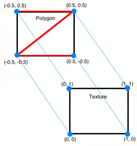
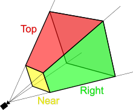
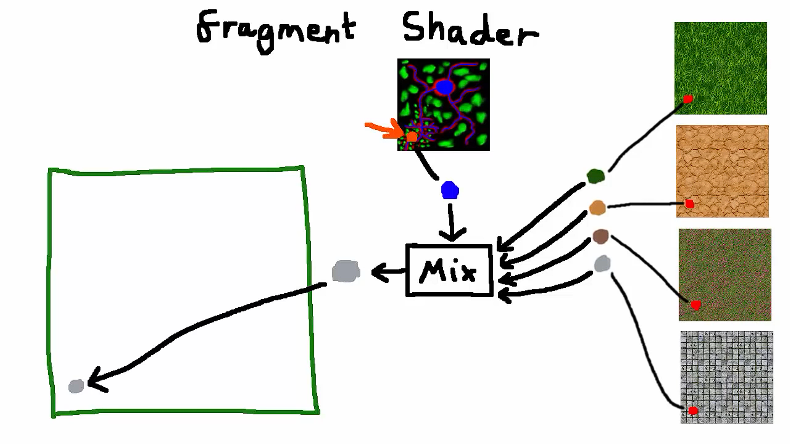

# 3D Engine Basics

Resources:

- https://www.opengl-tutorial.org/beginners-tutorials/tutorial-3-matrices/
- https://www.brainvoyager.com/bv/doc/UsersGuide/CoordsAndTransforms/SpatialTransformationMatrices.html
- https://www.youtube.com/watch?v=o-xwmTODTUI&t=296s&ab_channel=Miolith
- https://www.mathsisfun.com/algebra/matrix-introduction.html
- https://help.autodesk.com/view/MAYAUL/2024/ENU/?guid=GUID-D69C23DA-ECFB-4D95-82F5-81118ED41C95
- https://en.wikipedia.org/wiki/Viewing_frustum

## VAOs und VBOs

Ein VAO (Vertex Array Object) ist ein Objekt, in dem Daten über ein 3D
Objekt (wie z.B. Normals, Texture Coordinates, Vertices Positionen/Farben) in verschiedenen Attributen Listen gespeichert werden. Die Attribute Lists werden als VBO (Vertex Buffer Object) gespeichert. Ein VBO repräsentiert die Daten, die dann in dem VAO als einzelnes Attribut gespeichert werden.

Um das VAO abzurufen, kann man eine einzigartige ID verwenden, die jedem VAO zugewiesen ist.

Damit ein 3D Modell dargestellt werden kann verwendet man die Positionen der Vertices der einzelnen Dreiecke aus dem das Modell besteht. Die Positionen
der Vertices lassen sich dann in einem VBO speichern, welches dann einem Attribut des VAOs zugewiesen werden kann.

## Index Buffer

Um ein Rechteck mit Dreiecken darzustellen benötigt man 2 Dreiecke. Wenn man OpenGL jetzt die Vertex Positionen mitteilt überlappen sich die Informationen für die vier übereinanderlappenden Vertices, man gibt also für zwei Vertices die Position dieser Vertices doppelt an.

Deshalb benutzt man ein weiteres VBO, ein Index Buffer, in den Attribute Lists des VAOs um anzugeben wie OpenGL die Vertices miteinander "verbinden" soll, um Dreiecke zu erstellen. So vermeidet man doppelte Informationen von Vertex Positionen bei an den Ecken übereinanderlappenden Dreiecken. Auch wenn dadurch ein neues VBO entsteht, eliminiert schon ein Index einen ganzen Vektor.

## Shader

Die CPU macht alles was verarbeitet, berechnet etc. werden muss, wie z.B. die Spiele-Logik, Berechnungen, Gameplay, während die GPU die Szene auf dem Bildschirm rendert,
wobei die GPU bestimmen kann WIE die Szene und verschiedene Objekte gerendert werden (Licht, Schatten, Texturen, Nebel etc.).

Damals wurde eine Fixed Function Pipeline verwendet, mit der man der GPU einfach sagen konnte, was wie gerendert werden sollte, war aber auch sehr limitiert bezüglich
der Freiheit des Entwicklers.

Jetzt wird in OpenGL eine Programmable Pipeline verwendet, die nicht auf vorprogrammierte Funktionen basiert, sondern selber programmiert werden kann.
Erreicht wird das von Shadern, die mit einer Shader-Sprache wie GLSL programmiert werden können und auf der GPU ausgeführt werden.
Ein Shader-Programm benötigt 2 verschiedene Shader: Einen Vertex- und einen Fragment Shader.

Der Vertex-Shader wird ein mal für jeden Vertex ausgeführt, wobei es die VAO Daten als Input verwendet und die Positionen der Vertices zum Rendern ausgeben muss
und etwas anderes, Vertex spezielles, ausgeben kann was dann als Input für den Fragment-Shader verwendet wird.

Der Fragment-Shader wird für jeden Pixel des Objektes ausgeführt und
nimmt den berechneten Output des Vertex Shaders als Input entgegen. Um dann den Output für jeden einzelnen Pixel zu berechnen wendet der Fragment Shader Interpolation zwischen den 3 Vertices des Dreiecks an, in denen sich der Pixel befindet.

## Texturing

Texturen haben auch "eigene Koordinaten". In OpenGL befindet sich der Ursprung (0,0) des UV-Koordinatensystems jedoch oben links. In dem VAO kann man jetzt für jeden Vertex
eine UV Koordinate angeben, die dann angibt wie die Textur auf das Modell gemappt werden soll.

In dem Fragment Shader wird dann über eine Methode für jeden Pixel die Farbe so gesetzt, dass sie der Farbe des Pixels der Textur entspricht. Da das für alle Pixel in dem
Modell geschieht (durch die Interpolation vom Vertex zum Fragment Shader), hat man am Ende seine Textur auf das Modell übertragen.

## Matrizen

Es gibt 3 Eigenschaften die die Ausrichtung eines Objektes in der Welt beschreiben:

- Position: Dargestellt mit Hilfe eines Vektors bestehend x,y und z. Dieser Vektor beschreibt den "Offset" vom Ursprung auf jeder dieser Achsen, man kann sich die Position also als Offset der individuellen Achsen vorstellen.

- Rotation: Die Rotation des Objektes kann mit Hilfe verschiedener Arten wie z.B. mit Hilfe von Euler Rotation beschrieben werden. Euler Rotation beschreibt die Rotation durch einen Winkel des Objektes auf jeder Achse x,y und z wodurch sich dann ergibt: rx, ry und rz

- Scale: Die Scale gibt die Größe des Objektes an, wobei 1 die normale Größe des Objektes ist. Dadurch lässt sich das Objekt größer oder kleiner skalieren.

&#8594; Zusammen sind diese Eigenschaften bekannt als die Transformation eines Objektes. Mit einer Transformations Matrix lässt sich die Transformation des Objektes als Matrix darstellen.

Damit man nun die 3D Objekte auf einem 2D Bildschirm darstellen kann muss man diese auf den Bildschirm Abbilden (/Projizieren) wofür man eine Projektionsmatrix benötigt.
Eine Kamera im 3D Raum besteht aus einem Frustum, welcher meist die Form einer rechteckigen Pyramide hat. Das nähere Ende dieses Frustum nennt man Near Plane, das entferntere
Ende die Far Plane. Die Projektionsmatrix hält nun Infos über diese Projektion, welche mit Hilfe des Abstandes zur Near und Far Plane, sowie der FOV berechnet werden können.

Da es in unserer Welt aber keine richtige Kamera gibt und alles nur eine Simulation einer Kamera ist, kann man die Kamera auch selbstverständlich nicht bewegen. Daher muss man
die ganze Welt um die Kamera herumbewegen, anstatt irgendeine nicht existente Kamera versuchen zu bewegen. Das lässt sich auch mit einer Matrix machen und sie ist sozusagen das
komplette Gegenteil der Projektionsmatrix. Denn möchte man die Kamera nun 3 Einheiten nach rechts bewegen muss man für diese Illusion die gesamte Welt 3 Einheiten nach links bewegen, damit es am Ende so aussieht als ob die Kamera sich 3 Einheiten nach rechts bewegt hat.

## Wavefront OBJ

Ein Verständnis des .obj Dateiformates ist wichtig, um OBJ-Dateien laden und darstellen zu können. Wir benötigen folgende Daten um unser Modell darzustellen:

- Vertex Position
- Textur Koordinaten
- Vertex Indizes
- Normals

Im .obj Dateiformat treten sie wie folgt auf:

- Vertex Positionen: `v 1.000000 1.000000 -0.999999`
- Textur Koordinaten: `vt 0.500000 0.500000`
- Normals: `vn 0.000000 -1.000000 0.000000`

Jedoch stehen diese Daten willkürlich untereinander aufgelistet und nicht in der zugehörigen Reihenfolge. Die Normals 1 müssen also nicht zu den Vertex Positionen 1 passen.
Um trotzdem zu wissen welches Element welcher Liste zu einem Vertex gehört und aus welchen Vertices ein Dreieck aufgebaut ist, kann man die Info der Faces `f 2/3/1 3/4/1 4/6/1` nutzen. Diese gibt den Index der Vertex Position (2), der Textur Koordinate (3) und der Normale (1) in der entsprechenden Liste an. D.h. der erste Vertex
hat eine Position, die sich dem 2 Element der "Positionen Liste" entnehmen lässt usw. Dahinter folgen die 2 weiteren Vertices, die das Dreieck bilden.

## Lighting

Um Modells zu beleuchten gibt es verschiedene Arten von Licht:

1. **Diffuse Lighting**

   - "Sanftes" Licht ohne harte Schatten oder sonstiges. Wird mit dem Skalarprodukt zwischen dem einfallenden Licht und der Normalen der Vertex berechnet.

2. **Specular Lighting**

   - Licht, welches vordefiniert reflektiert wird und dadurch Glanz erzeugen kann. Um den Glanz angemessen darstellen zu können wird die Position der Kamera benötigt um dann das Skalarprodukt zwischen dem Vektor zur Kamera und dem Vektor des reflektieren Lichtes berechnen zu können.

3. **Ambient Lighting**

   - Ist dem Diffuse Lighting sehr ähnlich, aber unterscheidet sich darin, dass es keine total schwarzen Stellen gibt. Anstatt dessen ist jedes Objekt, auch dort wo kein Licht hinkommt leicht beleuchtet. Dies kann damit erreicht werden, in dem man z.B. nach dem Berechnen des Skalarproduktes alle Werte unter einem bestimmten Wert (z.B. 0.2) ignoriert.

## Terrain

Ein Terrain besteht aus einem Grid von einzelnen Terrain Tiles. Jeder dieser Tiles ist gleich groß und hat die selbe Anzahl an Vertices. Die Textures lassen sich auf dem Terrain auch tilen, sodass dieselbe Textur als Grid auf dem Terrain liegt und so die Illusion von einer durchgehend hochauflösenden Textur erzeugt.

Mit Multitexturing kann man außerdem mehrere Texturen verwenden, die immer noch effizient getiled werden können. Damit OpenGL auch weiß, wo diese unterschiedlichen Texturen
gerendert werden sollen, verwendet man eine Blend Map. Die unterschiedlichen Farben auf der Blend Map repräsentieren dann die einzelnen Texturen, woher OpenGL dann weiß wo welche Textur gerendert werden soll.

Die Farbe des Pixels am Ende ist eine Mixtur aus den Farben aller Pixel an der entsprechenden Stelle auf jeder Texturen, die verwendet werden. Dabei bestimmt der entsprechende Pixel auf der Blend Map wie die einzelnen Farben der verschiedenen Pixel für die finale Pixelfarbe gewichtet werden sollen.

## Transparenz

Das Problem mit Transparenz ist, dass Objekte die später gerendert werden durch das transparente Objekt nicht mehr sichtbar sein werden, da die Farbe des gerenderten Pixels vom transparenten Objekt schon "feststeht". Daher ist die Reihenfolge beim Rendern von transparenten Objekten sehr wichtig.

In dieser Engine wird eine Textur die Pixel mit einem Alpha Wert unter 0.5 hat als transparent angesehen und daher einfach nicht gerendert.

## Cubemap Textures

Textur die auf einen Würfel angewandt wird, so dass sich auf jeder Seite des Würfels dann eine 2D Textur befindet. Es sind jedoch keine 6 unterschiedlichen Texturen für die
verschiedenen Seiten, sondern 1 Textur mit 6 unterschiedlichen Abschnitten, die sich auf den Würfel mappen lassen. Um diese zu samplen kann man keine einfachen x, y Koordinaten
verwenden, von denen dann die Pixelfarbe wiedergegeben wird, sondern man benötigt einen 3D Vektor der den Pixel vom Zentrum des Würfels angibt.

