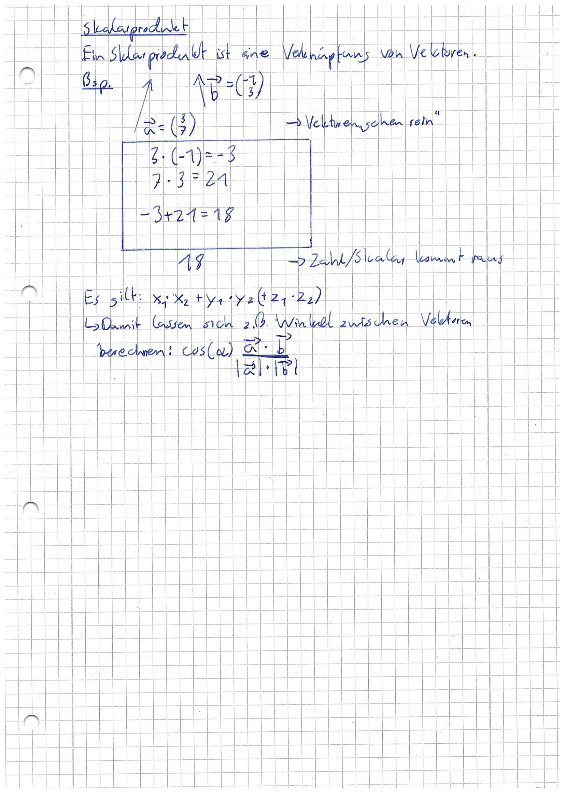
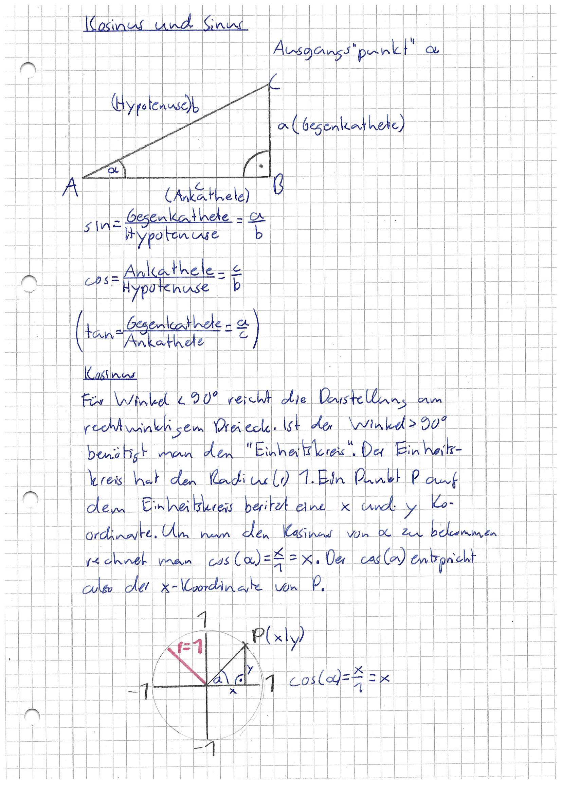
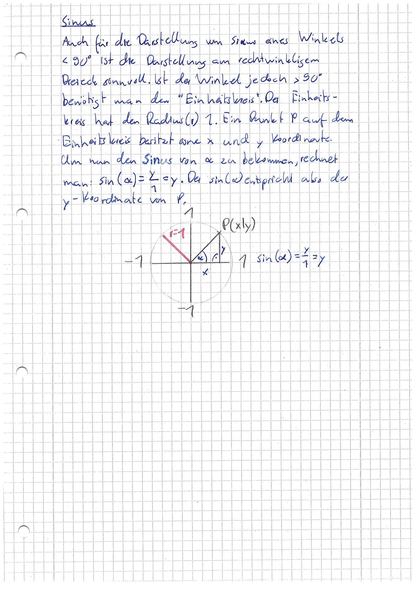
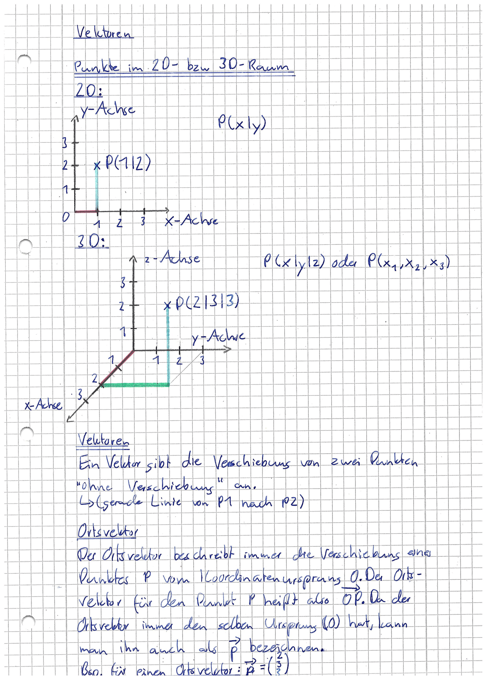
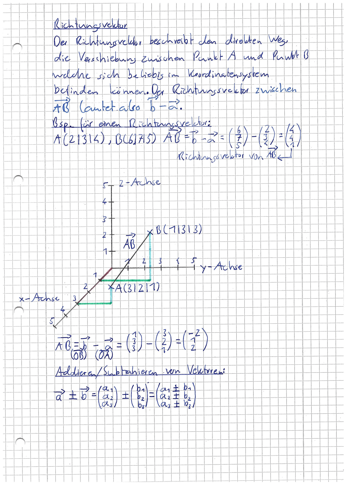
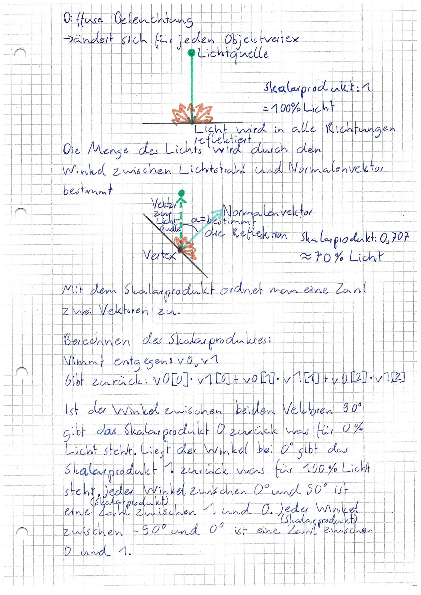
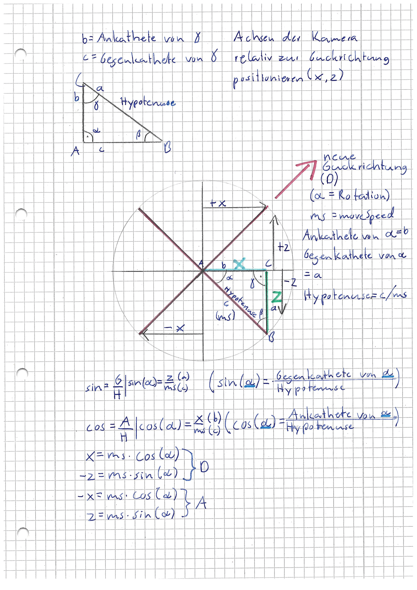
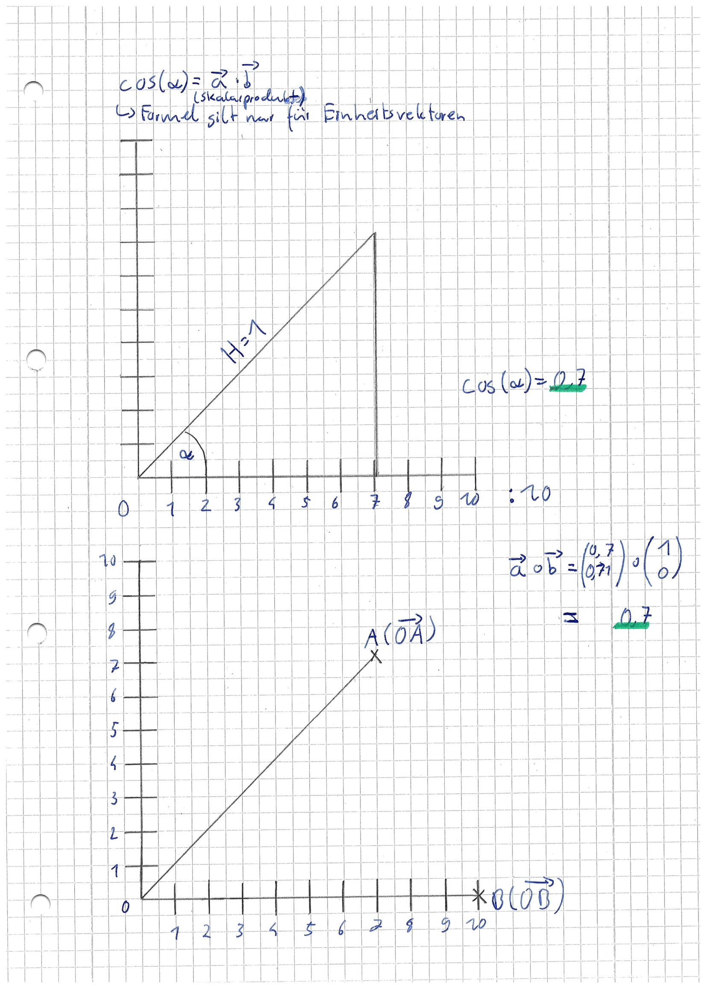

# Game Engine

Das ist meine erste "Game Engine" nach [dieser](https://www.youtube.com/watch?v=VS8wlS9hF8E&list=PLRIWtICgwaX0u7Rf9zkZhLoLuZVfUksDP&ab_channel=ThinMatrix) Tutorial Serie. Mich faszinierte hierbei, wie viel "Schulmathematik" benötigt wird.
Leider, da dieses Projekt zu der Zeit als ich in der 8. Klasse war entstanden ist, musste ich mir die Themen selber "beibringen".
Meine Notizen und Erklärungen zu den einzelnen Themen werden hier unten zu sehen sein. Um manche Themen wie Diffuse Lighting
oder Spectral Lighting zu verstehen musste ich jedoch auch noch Mathematische Grundlagen, welche für Operationen die bei diesen 
Themen benötigt werden, lernen. Zum Beispiel ist bei Diffuse Lighting oder Spectral Lighting das Skalarprodukt zweier Vektoren
wichtig, doch damit ich das alles verstehen konnte musste ich "Grundlagen" der Trigonometrie und der Analytische Geometrie lernen, was wie gesagt alles unten in meinen Notizen nachzulesen ist.

## Zusammenfassung

Für alle die die gesamte PDF lesen wollen: <a href="https://github.com/gabriel-java-github/game-engine/blob/main/Resources/GameEngine_Mathematik.pdf" target="_blank">"Grundlagen" der Trigonometrie und der Analytische Geometrie</a>

## Skalarprodukt

## Kosinus und Sinus

## Sinus

## Vektoren

## Richtungsvektor

## Diffuse Beleuchtung

## Spectral Lighting

## Weitere Rechnungen

